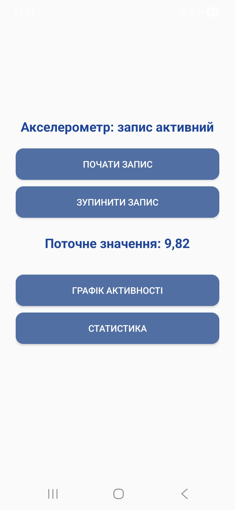
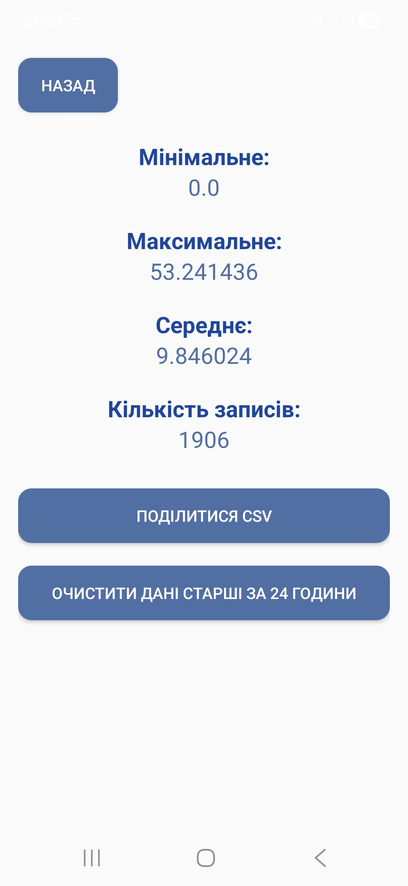

# ActivityMonitorApp

ActivityMonitorApp is an Android application that collects accelerometer data in real time, stores it locally using Room database, visualizes movement intensity on a live chart, and allows exporting data to a CSV file.  
The app also provides statistics such as minimum, maximum, average values, and total record count.

---

## Features

- **Real-time accelerometer tracking**
- **Room database storage**
- **Live chart visualization (MPAndroidChart)**
- **Statistics screen:** min, max, avg, count
- **CSV export** (via FileProvider - share through Telegram, Gmail, Drive, etc.)

## Project Structure

• data/
  - dao/ - Room DAO (SensorDao)
  - db/ - Room Database (AppDatabase)
  - entity/ - Data model (SensorData)

• sensor/
  - Accelerometer reader (SensorService)

• ui/
  - main/ - MainActivity (start/stop + live value)
  - chart/ - ChartActivity (MPAndroidChart graph)
  - stats/ - StatsActivity (min/max/avg/count + CSV export)

• utils/
  - CsvExporter (CSV file generation)

---

## Screenshots

### Main Screen
Shows live accelerometer value updates and controls for starting/stopping recording.

### Chart Screen
Displays real-time movement intensity graph using MPAndroidChart.

### Statistics Screen
Shows calculated statistics: minimum, maximum, average, and total count.

